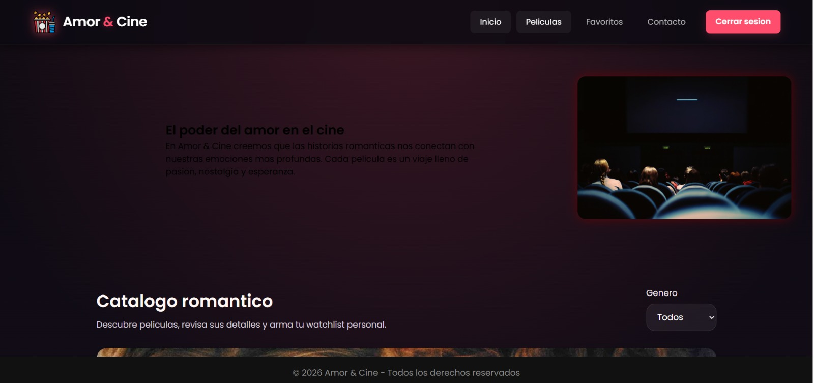
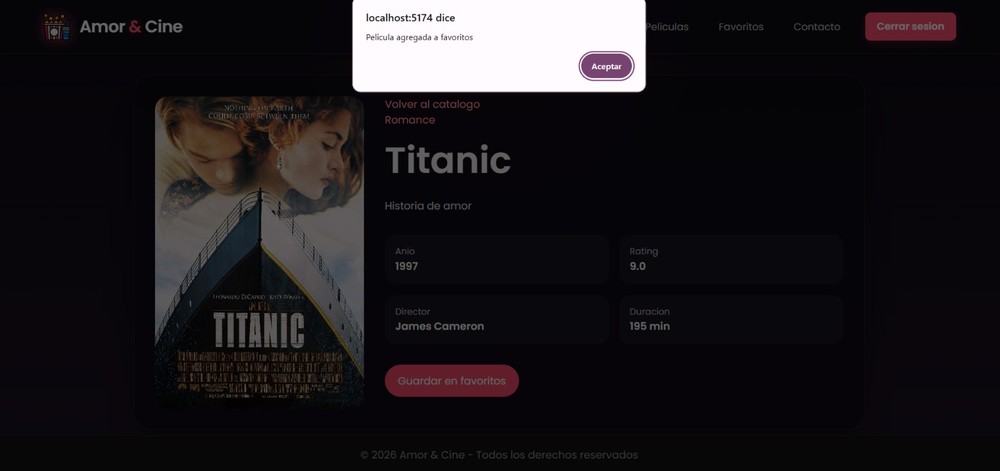
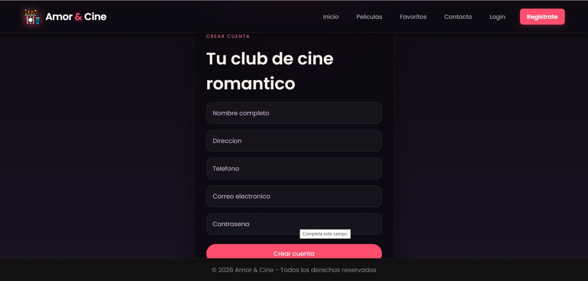
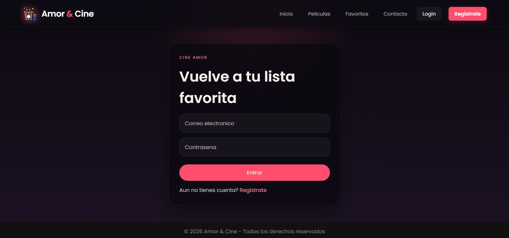
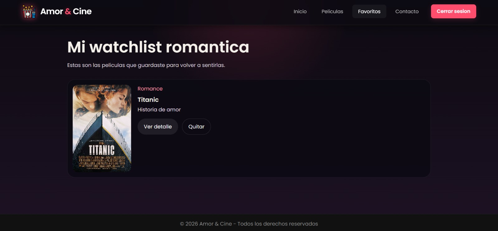
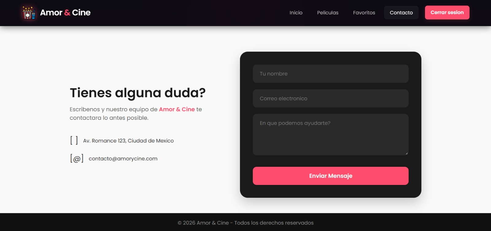
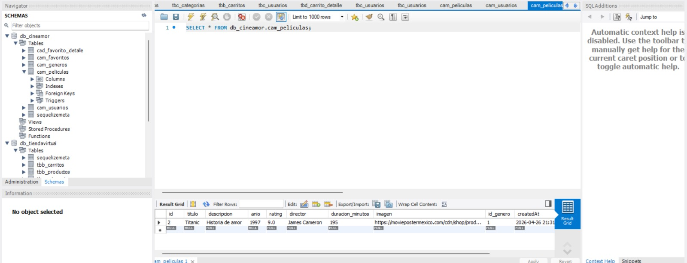

# 🎬 Cine Amor

Aplicación web dedicada a la gestión y recomendación de películas románticas. Permite a los usuarios explorar películas, agregarlas a favoritos y a los administradores gestionar el catálogo completo.

---

## 🚀 Tecnologías utilizadas

* Frontend: (React / Vue / HTML-CSS-JS)
* Backend: Node.js + Express
* Base de datos: MySQL
* ORM: Sequelize
* Autenticación: JWT

---

## 📂 Estructura del proyecto

```
cine-amor/
│
├── backend/
│   ├── models/
│   ├── controllers/
│   ├── routes/
│   └── middlewares/
│
├── frontend/
│   ├── components/
│   ├── pages/
│   └── services/
```

---

## 🔐 Funcionalidades principales

### 👤 Usuario

* Registro e inicio de sesión
* Ver catálogo de películas
* Ver detalles de películas
* Agregar a favoritos

### 🛠️ Administrador

* Crear películas
* Editar películas
* Eliminar películas
* Gestionar géneros

---

## 📡 Endpoints principales

### 🔑 Login

POST /api/login

### 🎬 Películas

* GET /api/peliculas
* POST /api/peliculas
* PUT /api/peliculas/:id
* DELETE /api/peliculas/:id

### 🎭 Géneros

* GET /api/generos
* POST /api/generos

## 🔑 Autenticación

Para acceder a rutas protegidas:

```
Authorization: Bearer TOKEN
```

---

## 🧪 Pruebas

Se utilizó Thunder Client para probar endpoints:

* Login
* CRUD de películas
* Gestión de usuarios












